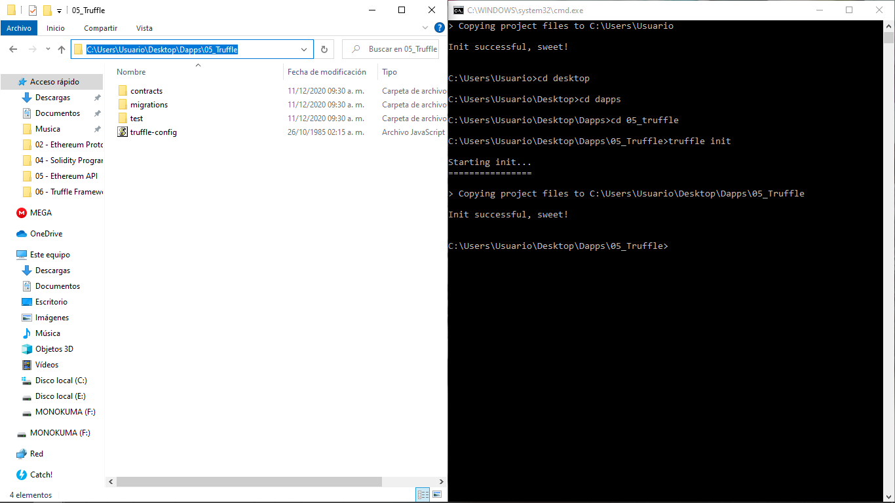
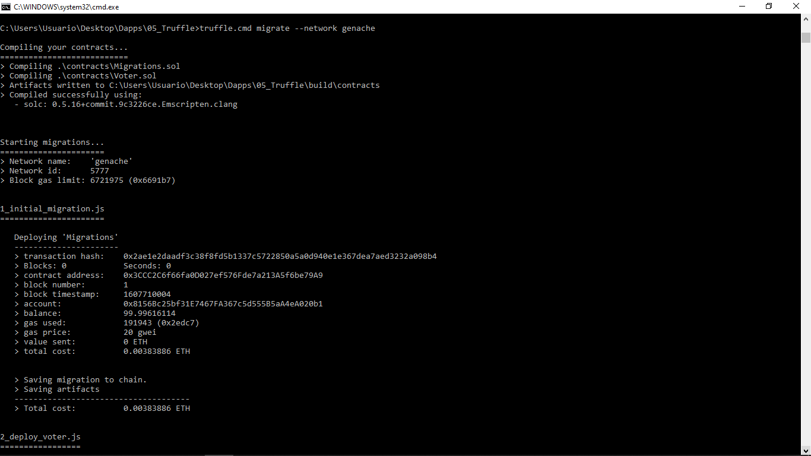
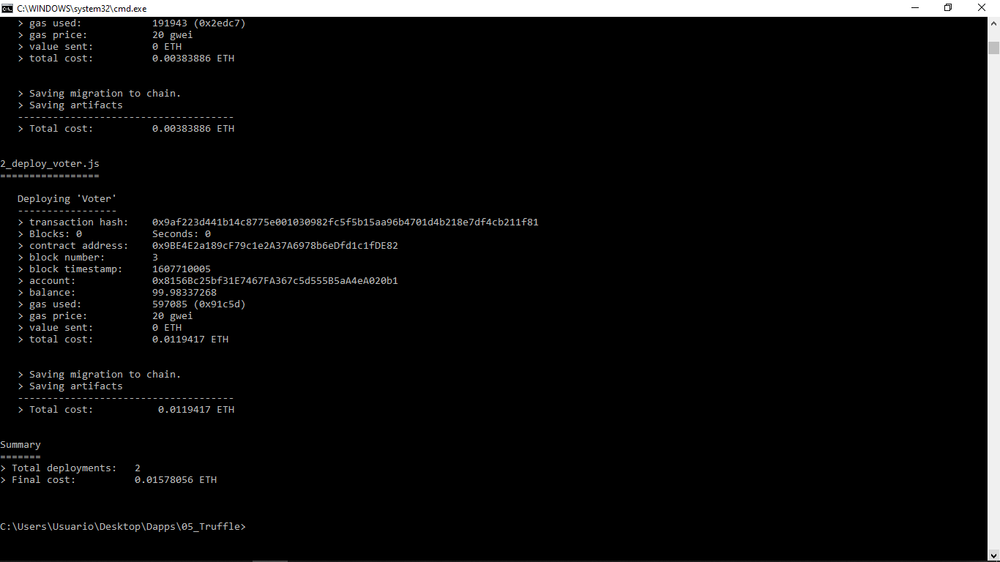
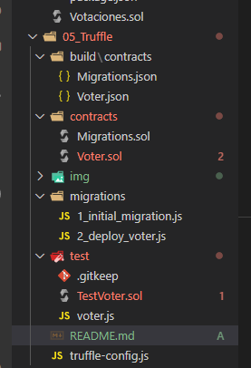

# DAPPS # Solidity #Truffle
Para esta practica comenzamos instalando Truffle en windows usando el siguiente comando en el CMD

"npm install -g truffle"

en algunos casos tambien se añade el siguiente:

"npm install - truffle-contract"

Una vez instalado, ubicamos en cmd la carpeta donde queremos realizar el proyecto y ejecutamos el comando:

"truffle init"

el cual nos generara automaticamente las siguientes 3 carpetas: contracts / migrations / test

Luego se edita el archivo que se genero por default llamado "truffle-config.js" (en algunos casos el archivo se llama solo truffle.js pero para evitar errores en windows se renombra a truffle-config o bien al ejecutar comandos en cmd se escribe por ejemplo "truffle.cmd init")

Luego una vez que editamos los archivos compilamos los contratos y migraciones que se quieran realizar en el proyecto

Si es satisfactorio, se generara automaticamente una nueva carpeta llamada "build\contracts" que contiene los json de los contratos.sol de la carpeta de contracts.

